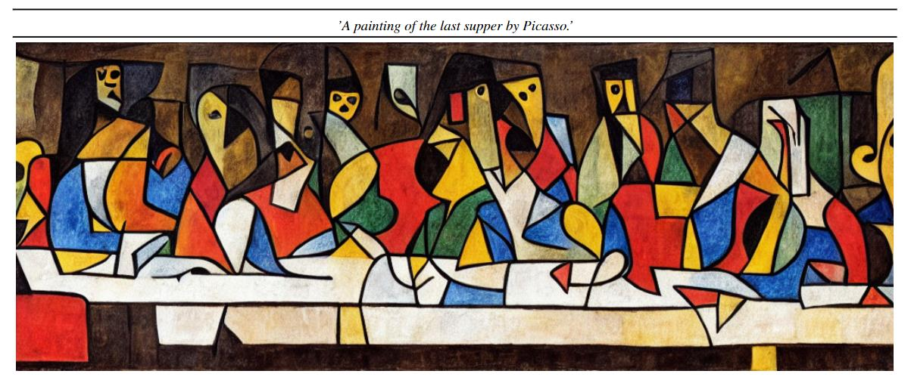

</a>

# Papers about watermarking&fingerprinting

> We collect a list of papers related to watermarking&fingerprinting technique, and this list will be updated now and again. 

  

# 
##### 2024
- Building Intelligence Identification System via Large Language Model Watermarking: A Survey and Beyond, 2024.7.15. [[paper]](https://www.arxiv.org/abs/2407.11100)
##### 2023
- Deep Intellectual Property Protection: A Survey, 2023.6.17. [[paper]](https://arxiv.org/abs/2304.14613)
- Building Intelligence Identification System via Large Language Model Watermarking: A Survey and Beyond, 2023.12.13. [[paper]](https://arxiv.org/abs/2312.07913)

# 
##### 2023
- A Watermark for Large Language Models, 2023.1.24. [[paper]](https://arxiv.org/abs/2301.10226)

# 

# 

# 
